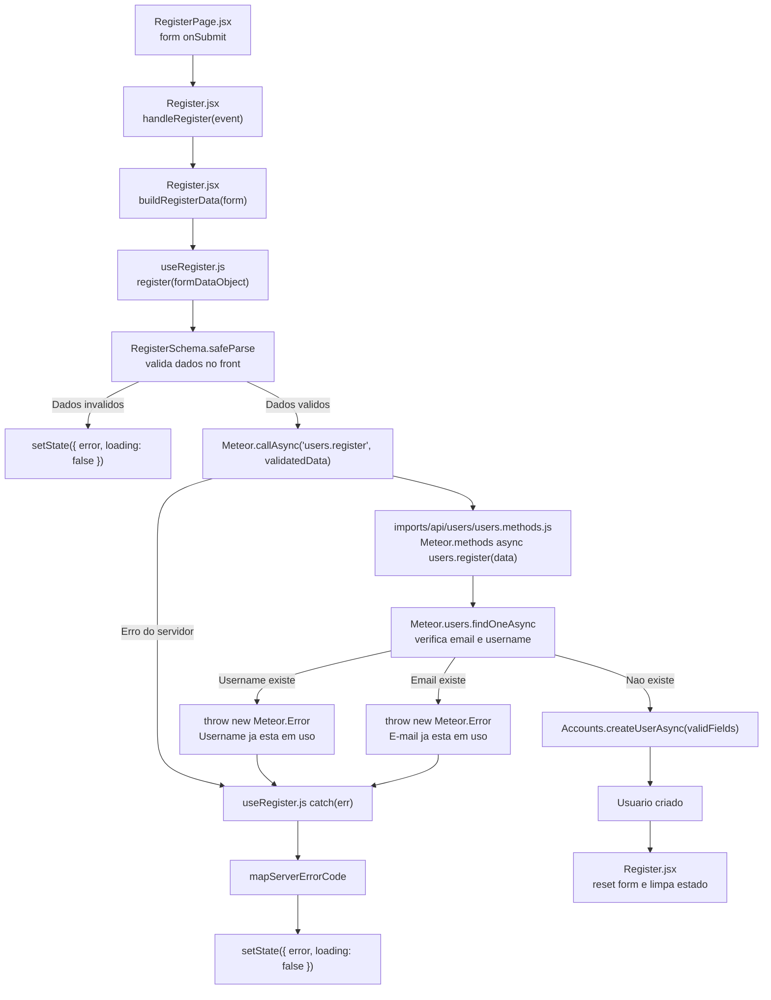

```mermaid
flowchart TD
    A["RegisterPage.jsx<br/>form onSubmit"] --> B["Register.jsx<br/>handleRegister(event)"]
    B --> C["Register.jsx<br/>buildRegisterData(form)"]
    C --> D["useRegister.js<br/>register(formDataObject)"]
    D --> E["RegisterSchema.safeParse<br/>valida dados no front"]
    E -->|Dados invalidos| F["setState({ error, loading: false })"]
    E -->|Dados validos| G["Meteor.callAsync('users.register', validatedData)"]
    G --> H["imports/api/users/users.methods.js<br/>Meteor.methods async users.register(data)"]
    H --> I["Meteor.users.findOneAsync<br/>verifica email e username"]
    I -->|Email existe| J["throw new Meteor.Error<br/>E-mail ja esta em uso"]
    I -->|Username existe| K["throw new Meteor.Error<br/>Username ja esta em uso"]
    I -->|Nao existe| L["Accounts.createUserAsync(validFields)"]
    L --> M["Usuario criado"]
    J --> N["useRegister.js catch(err)"]
    K --> N
    G -->|Erro do servidor| N
    N --> O["mapServerErrorCode"]
    O --> P["setState({ error, loading: false })"]
    M --> Q["Register.jsx<br/>reset form e limpa estado"]
```
